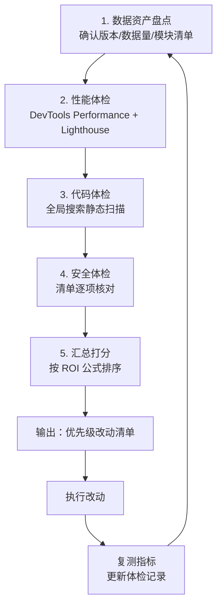
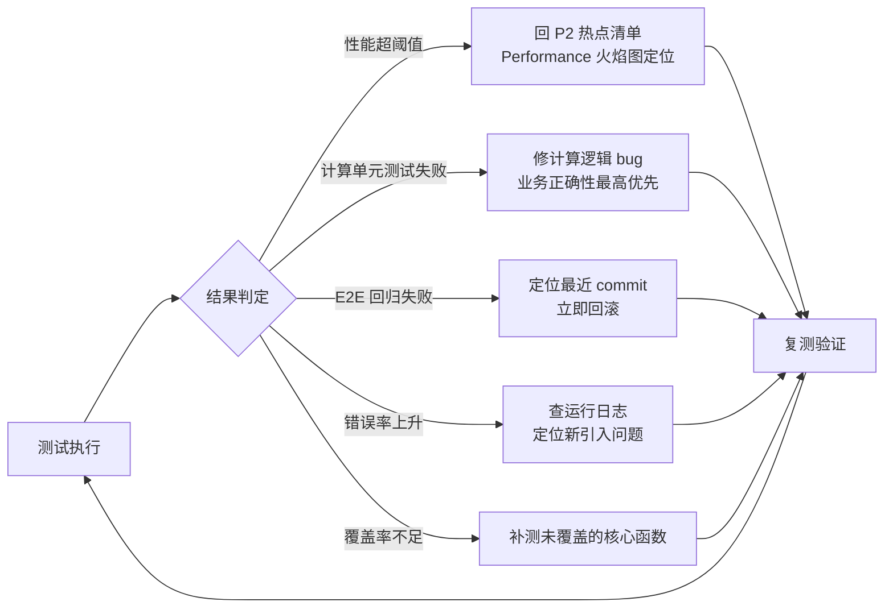

# CS CloudHub 系统性完善与落地方案

> 适用对象：Jordly（客服总监，非技术背景）／维护者
> 系统现状：纯原生 JS 单页应用；`app.js` 13135 行 / 664KB 单文件（20260723）；无构建、无测试；Mock + localStorage + CloudBase 云函数（csCloudHubAPI）同步；GitHub → Cloudflare Pages 自动部署（chanseen.pages.dev）；约 15 个业务模块。
> 产出：架构师高见远 · 2026-08-06

## 0. 总体原则（先立规矩，再谈方案）

1. **先保数据，再谈优化**：任何改动都有回归风险，数据不丢是第一优先级。
2. **先观测，后动手**：用数据决定改哪里，不靠猜。当前最大的问题不是"代码丑"，而是"不知道哪里有问题"。
3. **小步快跑，每步可回滚**：一次改动 = 一个 commit = 可一键回滚。
4. **不推翻重来**：13135 行单文件是"资产"不是"负债"。对非技术用户，**不建议**引入框架或大规模重构——那是灾难。方案全部是低成本、渐进式、可逆的。
5. **一切以 Jordly 能独立操作、独立验收为前提**。

**一句话结论**：这个系统最大的风险不是性能，而是"数据丢失 + 出错不可见"。因此优先做备份和观测，再做热点修复，最后才考虑结构治理。

---

## 1. 问题一：优化切入点识别（体检流程 + 检查清单 + 优先级筛选）

### 1.1 体检流程（5 步，每次体检约 2~3 小时）

**工具清单（全部免费、浏览器自带或网页端可用）**：
- Chrome DevTools（Performance / Network / Memory / Console）——浏览器自带
- Lighthouse（DevTools 内 Audit 标签）——浏览器自带
- VS Code 全局搜索 或 GitHub 仓库网页搜索——静态扫描
- Cloudflare Pages Analytics——线上访问/错误概况
- CloudBase 云函数控制台日志——云端调用情况

### 1.2 检查清单（5 大类，体检时逐项打勾）

#### A. 热点瓶颈检查清单（性能）

| # | 检查项 | 检查方法 | 判定标准（需优化） |
|---|--------|---------|------------------|
| A1 | 启动到可交互耗时 | DevTools Performance 录制整次刷新 | > 3 秒 |
| A2 | 各模块切换渲染耗时 | 逐模块切换 + Performance 录制 | 单模块 > 500ms |
| A3 | 大数据列表渲染 | 用"黄金数据集"（500 条项目记录）测列表 | > 1 秒 → 需分页/懒渲染 |
| A4 | localStorage 读写频率 | 搜索 `setItem` 调用点，统计写入时机 | 每次操作都全量写 → 需合并（防抖） |
| A5 | 云同步是否阻塞 UI | 同步进行时操作页面，观察卡顿 | 卡死 → 需异步 + 进度提示 |
| A6 | 事件/定时器泄漏 | 连续切换模块 20 次，看 Memory 曲线 | 内存持续上升 → 查泄漏 |
| A7 | 网络请求数量/体积 | DevTools Network | 重复请求 / 大响应 → 需缓存 |

#### B. 重复代码检查清单

| # | 检查项 | 检查方法 | 处理建议 |
|---|--------|---------|---------|
| B1 | 渲染函数相似度 | 搜 `function render` 列表，比对函数体 | ≥3 处且体量 >50 行的记入"可提取公共函数"候选 |
| B2 | 各模块 CRUD 模板重复 | 对比各模块新增/编辑/删除逻辑 | 提取公共 `crudService`（可选，P4） |
| B3 | 表单校验重复 | 搜校验相关代码片段 | 提取公共校验函数 |
| B4 | 模态框打开/关闭重复 | 搜 open/close modal 类代码 | 提取公共组件（可选） |
| B5 | 表格列定义重复 | 搜列配置数组 | 合并配置 |
| B6 | CSS 重复 | 不同选择器相同样式 | 合并类名（低优先） |

#### C. 异常处理缺失检查清单

| # | 检查项 | 检查方法 | 现状预判 |
|---|--------|---------|---------|
| C1 | 全局错误捕获 | 搜 `window.onerror` / `unhandledrejection` | 预期没有 → 盲区 |
| C2 | 云函数调用失败处理 | 搜云函数调用点，看是否有 `.catch` | 列出所有无 catch 的调用点 |
| C3 | `JSON.parse` 保护 | 搜 `JSON.parse` | 不在 try/catch 中的 → 高危 |
| C4 | localStorage 读写保护 | 搜 `getItem/setItem` | 无 try/catch（隐私模式/配额满会崩） |
| C5 | 空数据访问 | 搜 `.length/.map/.forEach` 前是否有判空 | 无判空直接调用 → 崩 |
| C6 | 用户输入校验 | 表单提交函数 | 无校验直接入库的字段 → 脏数据 |

#### D. 日志监控盲区检查清单

| # | 检查项 | 现状预判 | 建议 |
|---|--------|---------|------|
| D1 | 运行日志 | 无 | 建立环形日志（localStorage 存最近 500 条） |
| D2 | 登录/权限变更/删除审计 | 无 | 关键操作写审计日志 |
| D3 | 云同步状态可见性 | 无 | 顶部加同步状态提示（成功/失败/时间） |
| D4 | 性能计时埋点 | 无 | 启动、模块切换、同步耗时打点 |
| D5 | 删除保护 | 待查 | 删除前二次确认 + 删除记录入日志 |

#### E. 安全隐患检查清单

| # | 检查项 | 现状 | 建议 |
|---|--------|------|------|
| E1 | XSS 转义覆盖 | 已有转义实践 | 审计全部 innerHTML 插入点，确认都走转义函数 |
| E2 | 密码哈希 | SHA-256（无盐） | 升级 PBKDF2（浏览器 Web Crypto 原生支持，无需引库；登录成功时自动迁移老哈希） |
| E3 | localStorage 权限可被绕过 | 权限全在客户端 | 务实处理：承认局限 + 权限变更写审计日志；如需强管控，云函数端二次校验（成本高，列为可选） |
| E4 | 云函数鉴权 | 待查 | 云函数端校验来源/参数，避免裸调用 |
| E5 | 数据备份 | 待查 | 一键导出完整 JSON + 定期提醒 |
| E6 | 外链/CDN 完整性 | 待查 | 外链资源加 integrity 属性 |

### 1.3 优先级排序方法：ROI 评分公式

> **ROI =（影响面 S × 风险 R）÷ 改动成本 C**
> S：影响多少模块/操作（1~5）；R：不修的后果严重度，数据丢失=5、安全事故=5、持续恶化=4（1~5）；C：改动量（1=半天内，5=数周）。

**预判排序表（正式排序以首次体检实测为准）**：

| 排序 | 切入点 | S | R | C | ROI | 理由 |
|------|--------|---|---|---|-----|------|
| 1 | 一键数据备份 + 恢复演练 | 5 | 5 | 1 | 25 | 保命，成本极低 |
| 2 | 全局错误捕获 + 运行日志 | 5 | 4 | 1 | 20 | 所有后续优化的"眼睛" |
| 3 | 云同步失败提示 + 重试 | 4 | 4 | 2 | 8 | 防静默丢数据 |
| 3 | 密码 PBKDF2 升级 | 4 | 4 | 2 | 8 | 安全硬伤，成本可控 |
| 5 | 渲染热点优化（分页/懒渲染） | 4 | 3 | 2 | 6 | 用户可感知，须先测到瓶颈 |
| 6 | localStorage 写合并 | 4 | 2 | 1 | 8 | 小改动防卡顿 |
| 7 | 表单校验/异常补全 | 3 | 2 | 2 | 3 | 按日志数据补 |
| 8 | 代码拆分/重构 | 2 | 1 | 5 | 0.4 | 对非技术用户高风险低收益，放最后或不做 |

**筛选原则**：先做"保命"（备份/错误捕获），再做"治病"（热点/安全），最后才考虑"整容"（重构）。

---

## 2. 问题二：改动执行顺序（分阶段路线图）

### 2.1 阶段总览

### 2.2 各阶段详情

#### P0 数据安全网（投入 1~2 人日；收益 ★★★★★；优先级：立即做）

- **改哪些模块**：系统数据管理模块——新增"一键备份"按钮（把全部数据导出为 JSON 下载 + 同步一份到 CloudBase 备份集合），新增"备份提醒"（超过 7 天未备份，打开系统时提示）；编写"恢复演练"步骤（从备份 JSON 恢复的 dry-run，不覆盖现网）。
- **为什么先做**：P1~P4 每一次改动都有回归风险，先把"数据不丢"变成确定事实，后续才敢动代码。
- **如何降低回归风险**：纯新增功能，不触碰任何现有读写逻辑；备份函数独立成新函数。
- **版本控制/回滚**：独立 commit（`feat: 一键数据备份导出`）；出问题只需回滚该 commit；Cloudflare Pages Deployments 页一键 Rollback。

#### P1 可观测性（投入 2~3 人日；收益 ★★★★★；优先级：立即做）

- **改哪些模块**：全局（app.js 顶部）加 `window.onerror` + `unhandledrejection` 捕获，写入环形日志（localStorage 最多 500 条，防爆）；系统数据管理模块新增"运行日志"查看页（含错误、云同步、性能埋点三类）；云同步调用统一封装，失败时顶部提示 + 写入日志；关键路径（启动、模块切换）加性能埋点。
- **为什么先做**：没有数据，后续所有优化都是猜。错误日志也是 P3 测试的"眼睛"。
- **如何降低回归风险**：只加不改，全部为增量代码。
- **版本控制/回滚**：拆 2~3 个小 commit（错误捕获 / 日志页 / 同步封装），各自可回滚。

#### P2 热点与安全修复（投入 3~5 人日；收益 ★★★★；优先级：拿到 P1 数据后做）

- **改哪些模块**（按 P1 实测数据选 TOP 3~4，预判如下）：
  - 渲染热点：项目总览/运营数据等大列表加分页或懒渲染（最多影响启动和切模块卡顿）；
  - localStorage 写合并（防抖，改动极小）；
  - 异常处理补全：所有云函数调用点补 `.catch` + 用户提示；
  - 安全加固：密码 PBKDF2 升级（登录成功时自动把老 SHA-256 哈希迁移为新哈希）+ XSS 转义覆盖审计。
- **为什么先做这些**：用户能感知的痛点 + 真实风险，且单个改动都在半天量级。
- **如何降低回归风险**：每个改动独立 commit；每改完一处立即跑 P3 回归清单（P3 未建时先用"核心 8 步冒烟"：登录→建档→录目标→录成本→录运营→出报表→交接→权限）；全部改完做一次全量体检复测。
- **版本控制/回滚**：单点回滚（哪个 commit 出问题回滚哪个）+ P0 备份兜底。

#### P3 测试基线（投入 3~5 人日；收益 ★★★★；优先级：P2 完成后固化）

- **改哪些**：新增 `tests/` 目录与 `test.html`（自研 ~50 行断言函数即可，零依赖）；把核心**纯计算函数**（成本/利润、满意度、难度评估、绩效）提取到独立 `core-math.js`（app.js 改为调用该文件，行为保持不变）；建立"回归测试清单"文档（15 个模块逐项打勾）。
- **为什么先做**：P0~P2 改了一轮后，必须固化测试防止未来退化；计算函数是业务正确性核心，最值得先测。
- **如何降低回归风险**：提取函数采用"行为保持"策略——提取后立即跑全模块冒烟 + 黄金数据集比对（同一输入、同一输出）。
- **版本控制/回滚**：`core-math.js` 提取单独 commit，若比对不一致立即回滚该 commit。

#### P4 结构治理（投入 长期·可选；收益 ★★；优先级：最后）

- **改哪些**：建立代码分区规范（文件内用大注释分区分块 + 命名规范，让 13135 行"可导航"）；新代码写入规范（新增功能优先写成独立函数挂到全局命名空间，不再往主流程里堆）；**评估是否拆分**（不默认拆分）。
- **为什么最后做**：拆分单文件对非技术用户是高风险低收益动作。
- **判断是否拆分的标准**：只有当"新增一个功能平均耗时"成为真实痛点（例如加个小模块要半天且老出错）才拆；拆分采用"按模块提取 + 全局替换 + 每提取一个模块跑一次全量回归"，一次只提 1 个模块。
- **版本控制/回滚**：每次提取独立 commit，逐模块回滚。

### 2.3 版本控制与回滚策略（适配非技术用户）

| 事项 | 做法 |
|------|------|
| 提交工具 | GitHub Desktop 图形界面（推荐）或 GitHub 网页端直接编辑 |
| 提交规范 | 一次改动 = 一个 commit，message 写清，如 `P2-1 优化项目列表分页` |
| 改动前 | 系统内点"一键备份"导出数据（P0 建立后） |
| 回滚 | Cloudflare Pages → Deployments → 选中上一版本 → Rollback（一键） |
| 配套文档 | `CHANGELOG.md` 记录每次改动内容 + 对应回滚方法 |
| 发布节奏 | 建议每周五下午集中发布本周改动，避开工作日高峰 |

---

## 3. 问题三：测试方案

### 3.1 测试分层（务实版，不引重型工具）

| 层 | 测什么 | 用什么工具 | 维护成本 |
|----|--------|-----------|---------|
| 单元 | 纯计算函数（成本利润/满意度/难度/绩效/导入解析） | 自研 `test.html` + 断言函数（约 50 行） | 低 |
| 集成 | 跨模块数据链（档案→目标→成本→运营→绩效） | 手工脚本 + 黄金数据集比对 | 低 |
| 端到端 | 用户旅程回归（登录/建档/录数/报表/交接/权限） | 手工清单 + 截图存档（可选 Playwright 录制冒烟） | 中 |
| 性能 | 500/1000 条数据渲染、启动耗时、云同步耗时 | DevTools Performance + 埋点日志 | 低 |
| 验收 UAT | Jordly 真实工作流（月初报表/周例会/人员交接） | 验收清单逐项签字 | 低 |

### 3.2 测试矩阵（阶段 × 测试对象）

| 测试对象 | P0 | P1 | P2 | P3 | P4 |
|----------|----|----|----|----|----|
| 备份导出/恢复 | ● 主测 | 回归 | 回归 | 回归 | 回归 |
| 运行日志/错误捕获 | — | ● 主测 | 回归 | 回归 | 回归 |
| 云同步成功/失败/重试 | — | ● 主测 | ● 主测 | 回归 | 回归 |
| 成本/利润/满意度/难度/绩效计算 | — | — | ● 主测 | ● 单元测试主测 | 回归 |
| 大列表渲染（500 条） | — | 埋点 | ● 主测 | 性能回归 | 性能回归 |
| 权限控制与审计 | — | 审计日志 | ● 主测 | 回归 | 回归 |
| 密码迁移（SHA-256→PBKDF2） | — | — | ● 主测 | 回归 | 回归 |
| 15 个模块全量冒烟 | ● | ● | ● | ● 固化 | ● |

### 3.3 用例设计思路与测试数据准备

- **黄金数据集**：从生产环境用"一键备份"导出真实数据 → 本地脱敏（客户姓名/手机号/金额打码）→ 固定保存，作为每次回归的比对基线。**注意：脱敏后数据不要提交到 GitHub 公开仓库**（Jordly.github.io 是公开的）。
- **边界数据**：空列表、超长文本（500 字）、特殊字符（XSS 探针 ``、单引号、emoji）、负数金额、非法日期（2026-13-99）、超大数字。
- **大数据**：用脚本生成 100 / 500 / 1000 条模拟项目记录（借"系统数据管理"导入通道灌入），测完即还原黄金数据集。
- **用例设计思路**：每个模块至少 4 类用例——正常流（happy path）、边界值、异常输入、权限不足；每个跨模块数据链至少 1 条全链路用例（如：新建项目→录目标→录成本→录运营→绩效报表读数一致）。

### 3.4 测试结果反向驱动调优（闭环）

- 性能超阈值 → 回到 P2 用火焰图定位具体函数；
- 单元测试失败 → 计算逻辑 bug，优先修（直接影响业务数据正确性）；
- E2E 回归失败 → 最近一次 commit 有问题，回滚再查；
- 错误率上升 → 运行日志给出具体报错行号（P1 的埋点就是干这个的）；
- 覆盖率统计 → 核心计算函数覆盖数/总数，决定下一步补测哪里。

---

## 4. 问题四：可量化指标

### 4.1 指标体系（基线目标以首次实测为准）

| 维度 | 指标 | 测量方法 | 基线目标（建议） | 跟踪频率 |
|------|------|---------|----------------|---------|
| 性能 | 启动到可交互耗时 | DevTools 录制 3 次取中位数 | ≤ 3s | 每阶段 |
| 性能 | 500 条列表渲染耗时 | 埋点/脚本计时 | ≤ 1s | 每阶段 |
| 性能 | 云同步耗时 | 日志埋点 | 先测当前值再定 | 每阶段 |
| 错误 | 全局错误数/日 | 运行日志统计 | ≤ 3 | 每周 |
| 错误 | 云函数失败率 | 运行日志统计 | ≤ 5% | 每周 |
| 正确性 | 核心计算单元测试通过率 | test.html | 100% | 每阶段 |
| 覆盖 | 核心计算函数测试覆盖率 | 覆盖数/总数 | ≥ 80% | 每阶段 |
| 覆盖 | 回归清单模块覆盖率 | 手工清单 | 100%（15 模块） | 每阶段 |
| 安全 | 备份成功率 / 最近备份时间 | 系统记录 | 100% / ≤7 天 | 每周 |
| 安全 | 恢复演练通过 | 演练记录 | 每年 ≥2 次 | 半年 |
| 可维护 | app.js 行数趋势 | 统计 | 不增反降或持平 | 每月 |
| 可维护 | 重复代码候选数 | 静态扫描 | 递减 | 每季度 |
| 可维护 | 无注释大函数（>100 行）数 | 静态扫描 | 递减 | 每季度 |

### 4.2 基线建立方法

1. **统一测量环境**：Chrome 无痕模式 + 同一网络 + 固定数据集（黄金数据集），保证每次可比。
2. **测 3 次取中位数**，避免偶发波动。
3. **记录归档**：建 `体检记录.md`，第一次全量测量 = **基线（Baseline）**；此后每完成一个阶段 = **快照（Snapshot）**，与基线对比趋势。
4. **系统健康分**：各维度达标率加权——性能 30% + 错误 30% + 覆盖 20% + 安全 20%，百分制，一次体检一个分。

### 4.3 跟踪机制

- 每月一次"体检日"（2~3 小时）：跑 1.2 节检查清单 + 记录 4.1 节指标。
- 指标变化直接证明阶段收益：例如 P2 后启动时间 5s→2s、错误数 20→2，即投入有效；若指标无变化，说明改错了地方，回到体检数据重新选点。
- 每次上线前：跑一次"核心 8 步冒烟"（登录→建档→录目标→录成本→录运营→出报表→交接→权限），通过才发布。

---

## 5. 投入/收益总表（帮 Jordly 选性价比最高的路径）

| 阶段 | 投入（人日） | 收益 | 建议 |
|------|------------|------|------|
| P0 数据安全网 | 1~2 | 数据不丢，后续改动有底气 | ★★★★★ 立即做 |
| P1 可观测性 | 2~3 | 所有决策有据，错误可见 | ★★★★★ 立即做 |
| P2 热点与安全修复 | 3~5 | 性能/安全/体验提升 | ★★★★ 拿到 P1 数据后做 |
| P3 测试基线 | 3~5 | 防退化，敢改代码 | ★★★★ P2 完成后固化 |
| P4 结构治理 | 长期·可选 | 维护性提升 | ★★ 有痛点再启动 |

**给 Jordly 的第一周行动清单**：
1. 本周：系统数据管理模块加"一键备份"按钮 + 备份提醒（P0）；
2. 本周：开启全局错误捕获与运行日志（P1 前半）；
3. 两周内：完成第一次全量体检，记录基线；
4. 一个月：按体检数据完成 P2 热点修复；
5. 持续：每月体检日 + 健康分跟踪；每次上线前跑核心 8 步冒烟。

---

## 6. 风险与边界说明（诚实告知）

1. **权限系统的根本局限**：localStorage 权限可被懂技术的人绕过。本方案务实处理：本地权限 + 审计日志 + 明确告知局限；若未来业务要求强管控（如外部审计），需在云函数端加二次校验（成本高，单独立项）。
2. **SHA-256→PBKDF2 迁移**：老密码哈希无法逆向转换，采用"登录成功时自动迁移"策略，无需用户重置密码。
3. **脱敏数据纪律**：测试数据若上传 GitHub 必须脱敏，公开仓库默认全世界可见。
4. **拆分不默认做**：13135 行不是必须拆的理由；只有当"改代码频繁出错/新增功能太慢"成为事实时才启动 P4，且逐模块小步进行。
5. **体检是持续动作**：本方案的价值靠每月体检维持，一次体检 + 一轮修复解决不了所有问题，但能保证系统不持续恶化。
